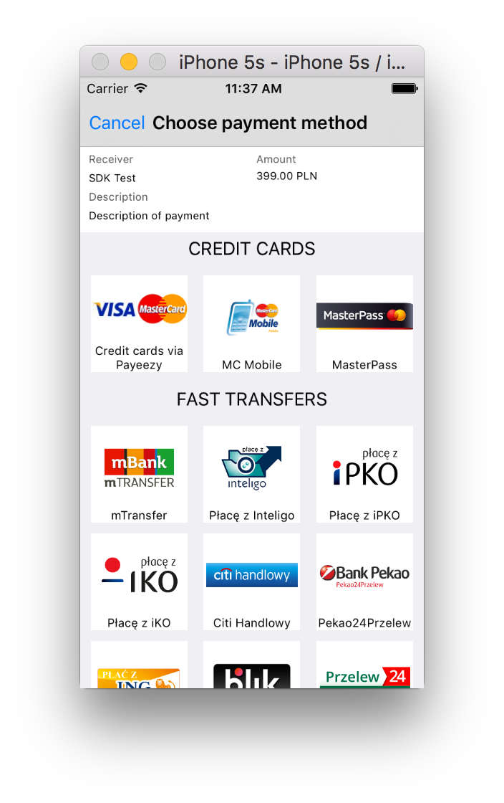

# DotPaySDK


## desrciption for the new version 1.2.0 being prepared ...

### Technical manual for developers [PDF - polish](https://github.com/dotpay/Mobile-SDK-iOS/blob/master/dotpay_mobile_sdk_ios_1.2.0/doc/Dotpay_Mobile_SDK-iOS-Instrukcja_dla_developera_v1.2.0.pdf)

### Latest version: (https://github.com/dotpay/Mobile-SDK-iOS/releases/latest)

-----------------

SDK (iOS) Version 1.0.3



# Latest stable Version

https://github.com/dotpay/Mobile-SDK-iOS/releases/latest

## Introduction
Set of software development tools (SDK library) that allows to integrate merchant’s mobile application with Dotpay payment system.
Thanks to devolving as many steps from our web application as possible to mobile application, the payment process is more convenient for a user and a developer obtains more control over it.
There is an option to modify vizualization style of SDK (colors, fonts) to have best integration possible with merchant’s mobile application.
The SDK library was created in language Objective-C. It supports iOS version 8.0 and higher.

# How to get started

install via [CocoaPods](https://cocoapods.org)

```obj
pod 'DotPaySDK'
```

### Classic
 
You have to add the SDK to a project and initialize it in a proper way to use it. Details of these steps were described in next chapters.
In order to make it easier to start with SDK, we deliver a test application, available in example sub-directory. Project settings

- The Dotpay framework has to be added to a project. It is located in lib sub-directory (in the bookmark Build Phases please select section Embed Frameworks).
- The JavaScriptCore framework has to be added to the project.
The header file has to be imported to every place that uses SDK:

```objc
#import <DotPaySDK/DotPaySDK.h> 
```

### System selection
The SDK library may communicate both with Dotpay production and test environment. SDK library works in production version by default.
In order to select the test system, you need to follow the instruction:

```objc
    [DotPay sharedInstance].debugMode = YES;
```

In order to select the production system, you need to follow the instruction:

```objc
    [DotPay sharedInstance].debugMode = NO;
```

### Payment process
The payment process consists of displaying controller `DPDotPayViewController` and awaiting calling out a delegate method that returns control.
The SDK library will guide the client through the process of selecting payment channel, passing on/verification client’s data, selecting extra options, accepting proper terms of use and finalizing the payment process.
In the event of paying for real goods, payment status received from SDK is just informational, a right order status will be delivered in the backend system according to Dotpay technical manual.
In next chapters there are described steps required to use payment controllers and extra options that enable adjusting payment process to own needs.

### Preparing return delegate
Preparing payment process starts from preparing delegate
`DPDotPayViewControllerDelegate:`

```objc
-(void) dotpayViewController: (DPDotPayViewController*)viewController didFinishPaymentWithSummary: (DPPaymentSummary *)paymentSummary;
-(void) dotpayViewController: (DPDotPayViewController*)viewController didFailToFinishPaymentWithError: (NSError *)error
```

### Initializing payment process
A payment description has to be prepared to start the payment process. An instance of a class DPPaymentInfo has to be created and filled out with data described in the table below:

|                       |                                                                                                                                                                                                                                                                                                                                                                                                                                                                                                                                                              |
|-----------------------|--------------------------------------------------------------------------------------------------------------------------------------------------------------------------------------------------------------------------------------------------------------------------------------------------------------------------------------------------------------------------------------------------------------------------------------------------------------------------------------------------------------------------------------------------------------|
| merchantID            | Type: `NSString` Merchant's ID number in Dotpay system                                                                                                                                                                                                                                                                                                                                                                                                                                                                                                       |
| amount                | Type: `NSDecimalNumber` Order amount                                                                                                                                                                                                                                                                                                                                                                                                                                                                                                                         |
| textDescription       | Type: `NSString` Order description                                                                                                                                                                                                                                                                                                                                                                                                                                                                                                                           |
| currency              | Type: `DPCurrency` Default value: „PLN” It describes currency of parameter amount. In the chapter Available currencies we,described a way how to download available currency list                                                                                                                                                                                                                                                                                                                                                                            |
| senderInformation     | Type: `NSDictionary` Default value: nil Additional information on client, e.g. name, surname, email...,Keys:,“firstname”; “lastname”; “email”; “phone”; “street"; “street_n1” – building number; "street_n2" – flat number; "postcode"; "city"; "country" (3 letters ISO3166).,These values are not mandatory. We recommend to pass on at least name, surname and email. The payment form should be filled out with that type of data. SDK will ask a client for missing data.,Specific explanation of these fields is described in Dotpay technical manual. |
| additionalInformation | Type: `NSDictionary` Default value: nil Extra parameters handed over in a payment process in accordance with additional technical manuals.                                                                                                                                                                                                                                                                                                                                                                                                                   |
| Control               | Type: `NSString` Default value: nil The parameter that defines a payment, handed over in payment confirmation, which is sent to a Shop. This parameter is required to match a payment status to an appropriate order in a Shop.,More information you will find in the Dotpay technical manual. If not set, it’s generated by SDK. ATTENTION,To have properly working payment history, this parameter should be unique for every order.                                                                                                                       |
| urlc                  | Type: `NSString` Default value: nil URL address used for receiving payment information (order completed or rejected).More information you will find in the Dotpay technical manual.                                                                                                                                                                                                                                                                                                                                                                          |


# Example:

```objc
DPPaymentInfo *info = [[DPPaymentInfo alloc] init];
info.currency = [DPCurrency currencyWithCode:@"PLN"];
info.amount = [NSDecimalNumber decimalNumberWithString:@"100.0"];
info.merchantID = @"10000";
info.textDescription = @"Some description";
info.senderInformation = @{@"firstname": @"Jan”, @"surname": @"Kowalski”,
@"email": @"kowalski@test.pl"};
info.additionalInformation = @{@"id1": @"12345”, @"amount1": @"40”, @"id1": @"67890”, @"amount2": @"60"};
```

The next step is downloading channels list by means of one of the following methods, passing on transaction details:
- downloads all channels

```objc
[[DotPay sharedInstance] getChannelListForPaymentInfo:info withCompletion:^(NSArray *channelList, DPPaymentDetails *paymentDetails, NSError *error) { }]
```

- downloads channels that are currently online/offline

```objc
[[DotPay sharedInstance] getChannelListForPaymentInfo:info online:online withCompletion:^(NSArray *channelList, DPPaymentDetails *paymentDetails, NSError *error) { }]
```

- downloads channels according to ID

```objc
[[DotPay sharedInstance] getChannelListForPaymentInfo:info withIds:ids withCompletion:^(NSArray *channelList, DPPaymentDetails *paymentDetails, NSError *error) { }]
```

- downloads channels of given types

```objc
[[DotPay sharedInstance] getChannelListForPaymentInfo:info group:group withCompletion:^(NSArray *channelList, DPPaymentDetails *paymentDetails, NSError *error) { }]
```

At the end a controller in the main thread is presented asynchronous and the following operations are executed:

* Initializing payment controller with channels list and payment details
* Optional last selected channel shutdown (this option is turned on by default)
* Set a return delegate
* Display a controller

## Example:

```objc
__weak typeOf(self) weakSelf = self;
dispatch_async(dispatch_get_main_queue(), ^{
    DPDotPayViewController *dotPayViewController =
    [[DPDotPayViewController alloc] initWithPaymentChannelList:channelList
    paymentDetails:paymentDetails];
    dotPayViewController.useLastChannelSelection = NO;
    dotPayViewController.paymentControllerDelegate = weakSelf;
    [weakSelf presentViewController:dotPayViewController animated:YES
    completion:NULL];
}); }];
```

## Finalizing payment process

A correctly finalized payment process is signalized by a proper delegate method.
In the event of successful payment process, the method `dotpayViewController:didFinishPaymentWithStatus` is called out. The argument of this method is the class `DPPaymentSummary` object, that holds payment details.

If the payment process finishes with an error, the `dotpayViewController:didFailToFinishPaymentWithError:` method will be called out with argument, which is an error description.

# ATTENTION!
A finalized payment process with a success doesn’t mean the payment was processed, but it means the payment had no errors. A payment result will be returned in an appropriate event parameter.
Examples of event handlers:

```objc
-(void) dotpayViewController: (DPDotPayViewController *)viewController didFinishPaymentWithSummary: (DPPaymentSummary *)paymentSummary {
    if([paymentSummary.type isEqualToString: kDPPaymentSummaryStatusCompleted]) {
        // payment successful
    } else if ([paymentSummary.type isEqualToString: kDPPaymentSummaryStatusRejected])
    {
        // payment rejected
    } else {
        payment is being processed
    }
}
-(void) dotpayViewController: (DPDotPayViewController *)viewController didFailToFinishPaymentWithError: (NSError *)error {
    //payment error
}
```
    
## Available currencies
A list of currencies supported by Dotpay can be downloaded by the following method of PaymentManager:

```objc
[[DotPay sharedInstance] getCurrencyListWithCompletion:^(NSArray *currencyList, NSError *error){
}];
```

### Changing presentation style
In order to change presentation style of controls element in a payment process the `UIAppearance` has to be used.
Using the appearanceWhenContainedIn system control method, presentation changes may be limited only to specific payment controllers:
- `DPPaymentChannelsViewController` – channel selection controller
- `DPPaymentFormViewController` – Payment form controller. This controller is not available for developer,so that to use it the *NSClassFromString* is required `NSClassFromString(@”DPPaymentFormViewController”)`
- `DPPaymentSummaryViewController` – confirmation page controller
  

### Personal channel selection control
SDK library enables replacing default channel selection control, to adjust needs of Merchant’s shop. The following steps are required to use this possibility:
1. Prepare an object of the DPPaymentDetails class and fill it out with data (in accordance with aforementioned chapter Payment initialization)
2. Download channels list (channels, in which we are not interested may be deleted) along with downloading payment details:

```objc
[[DotPay sharedInstance] getChannelListForPaymentInfo:info withCompletion:^(NSArray *channelList, DPPaymentDetails *paymentDetails, NSError *error) { }
```

3. At the end a controller in the main thread is presented asynchronous:
a. Initializing personal payment controller with channels list and payment details
b. Initializing the DPDotPayViewController payment controller with indicating personal channel payment controller
c. Setting a return delegate
d. Displaying Dotpay payment controller

#### Example:

```objc
dispatch_async(dispatch_get_main_queue(), ^{
    MyCustomChannelViewController *myChannelViewController = [[MyCustomChannelViewController alloc] initWithPaymentChannelList:channelList ];
    DPDotPayViewController *paymentViewController = [[DPDotPayViewController alloc] initWithPaymentChannelSelectionController: myChannelViewController paymentDetails:paymentDetails];
    paymentViewController.paymentControllerDelegate = self;
    [self presentViewController:paymentViewController animated:YES completion:NULL];
});
```

### Special channels support

Extra functions related to special payment channels are described.

#### Credit card payment - 1Click
1Click functionality enables quick payment process with a saved credit card. Basic credit card data are saved in Dotpay system, while CVV is saved in SDK library (after proper encoding).
This functionality (if available in Merchant’s shop) is turned on by default in SDK. A client’s consent is also required to use 1Click (while filling out the payment form).
In order to turn off 1Click, the following command is required:

```objc
[DPOneClickManager sharedInstance].enabled = NO;
```

In order to turn off only CVV saving, the following command is required:

```objc
[DPOneClickManager sharedInstance].cvvStoreEnabled = NO;
```

### ATTENTION
After turning off aforementioned options, formerly saved credit card data is not removed. To remove that data, the following commands are required.
An additional Developer’s duty is to create an option to remove saved credit card data. To find out, if credit card data are saved, the following command is required:

```objc
[[DPOneClickManager sharedInstance] isDataAvailable];
```

The following method removes credit card data:

```objc
[[DPOneClickManager sharedInstance] clearData];
```

Executing this method removes credit card number from Dotpay system and data stored locally.
The option of removing only CVV number is also available. In order to check, if CVV is stored locally, the following method is required:

```objc
[[DPOneClickManager sharedInstance] isCVVDataAvailable];
```

In order to remove CVV number only, the following method is required:

```objc
[[DPOneClickManager sharedInstance] clearCVVData];
```


### Transaction history and status

SDK library offers saving and displaying transaction history. The transaction history also displays related operations, e.g. subsequently made refunds and other additional operations.
The use of built-in control
In order to use built-in history control, the DPPaymentHistoryController controller has to be initialized and displayed:

```objc
DPPaymentHistoryController *historyController = [[DPPaymentHistoryController alloc] initWithPaymentHistory:nil];
[self presentViewController:historyController animated:YES completion:NULL];
```

### Changing presentation style

A change of presentation way of controls elements in payment process is made with a use of the UIAppearance framework. Detailes are described in the chapter A change of presentation style.
A history controller, for which presentation change limitations may be applied to is `DPPaymentHistoryController`.

#### Example:

```objc
[[UIView appearanceWhenContainedIn: [DPPaymentHistoryController class], nil] setBackgroundColor:[UIColor redColor]];
```

Personal history control
SDK library offers creating personal history control by downloading only data from the library, to better match web shop specification
The downloading payment history data is available in the paymentHistory attribute of singleton DPPaymentHistory:

```objc
NSArray *paymentSummaries = [DPPaymentHistory sharedInstance].paymentHistory;
```

Additionally for transactions in personal history you can:
1. Remove a single transaction

```objc
[[DPPaymentHistory sharedInstance] removePaymentSummary: paymentToRemove];
```

2. Check current payment status for a record in the history and refresh displayed data:
a. In personal view `DPPaymentHistoryObserver` observer methods are implemented, which refresh history view:

```objc
- (void)paymentHistory:(DPPaymentHistory *)paymentHistory didUpdatePaymentSummary:(DPPaymentSummary *)paymentSummary;
- (void)paymentHistory:(DPPaymentHistory *)paymentHistory didFailedToUpdatePaymentSummary:(DPPaymentSummary *)paymentSummary withError:(NSError *)error;
```

b. Register observer waiting for history changes

```objc
[[DPPaymentHistory sharedInstance] registerObserver: self]
```

c. Call out a method that updates payment status:

```objc
[[DPPaymentHistory sharedInstance] updatePaymentSummary: paymentToUpdate];
```

d. While releasing custom history controler, unregister history change observer

```objc
[[DPPaymentHistory sharedInstance] unRegisterObserver: self]
```

License
----

*Academic Free License ("AFL") v. 3.0*
